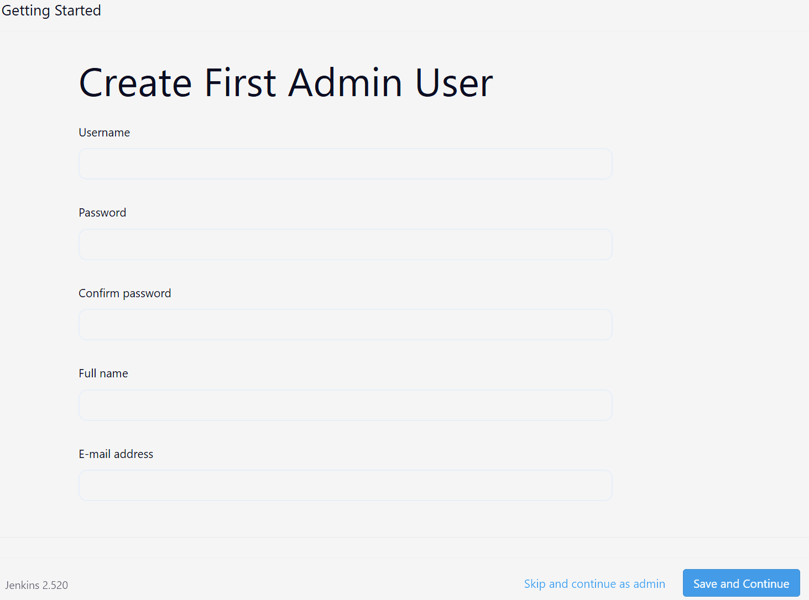

# Introduction and Installation

Jenkins is the leading open source automation server, Jenkins provides hundreds of plugins to support building, deploying and automating any project.<br>
[jenkins.io](https://www.jenkins.io/)

### Linux Dev VM

CentOS Stream 9 running on Virtual Box.<br>
[rockylinux.org](https://rockylinux.org)

---

### Install Docker

[Docker install for CentOS](https://docs.docker.com/engine/install/centos/)

Start docker on system boot.<br>
`sudo systemctl enable docker`

Enable permissions to see docker as user. Then logout and log back in.<br>
`sudo usermod -aG docker <username>`

Check docker is running.<br>
`docker ps`

---

### Install Jenkins on Docker

[Jenkins Docker Hub Image](https://hub.docker.com/r/jenkins/jenkins/)

Pull docker image.<br>
`docker pull jenkins/jenkins`

Show downloaded docker images.<br>
`docker images`

Show where docker is saving images.<br>
`docker info | grep -i root`

Show the size of the docker images folder.<br>
`sudo du -sh /var/lib/docker`

Create a jenkins data folder and move to the folder.<br>

```
mkdir jenkins-data
cd jenkins-data
```

Create a jenkins_home folder.<br>
`mkdir jenkins_home`

Create a docker compose file.<br>
`nano docker-compose.yml`

Add the following code.<br>

```
version: '3'
services:
  jenkins:
    container_name: jenkins
    image: jenkins/jenkins
    ports:
      - "8080:8080"
    volumes:
      - $PWD/jenkins_home:/var/jenkins_home
    networks:
      - net
networks:
  net:
```

Change ownership of jenkins_home for user 1000.<br>
`sudo chown 1000:1000 jenkins_home -R`

Start docker compose.<br>
`docker compose up -d`

Show jenkins container logs.<br>
`docker logs -f jenkins`

The logs will show the intial admin password:

```
*************************************************************
*************************************************************

Jenkins initial setup is required. An admin user has been created and a password generated.
Please use the following password to proceed to installation:

e043e2ccde6547e78fc9f9f25d894587

This may also be found at: /var/jenkins_home/secrets/initialAdminPassword

*************************************************************
*************************************************************
*************************************************************
```

Navigate to jenkins in a web browser and add the password from the logs.<br>
`http://<vm-ip>:8080`

Click install suggesred plugins.<br>


Create first admin user. <br>


Keep the URL as default.<br>


Add an local dns entry to the windows hosts file.<br>
Location (open notepad as admin):`C:\Windows\System32\drivers\etc`<br>

Add the entry.<br>
`<vm_ip> jenkins.local`

In a web browser navgate to.<br>
`http://jenkins.local:8080`

Docker Commands:<br>
Stop docker container:`docker compose stop jenkins`
Start docker container:`docker compose start jenkins`
Restart docker container: `docker compose restart jenkins`
Delete all services(keeps local container files)`docker compose down`
restore all services`docker compose up`
